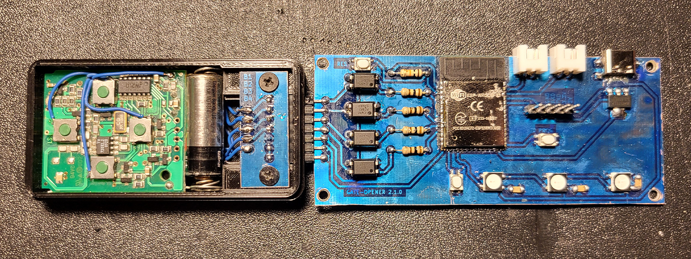
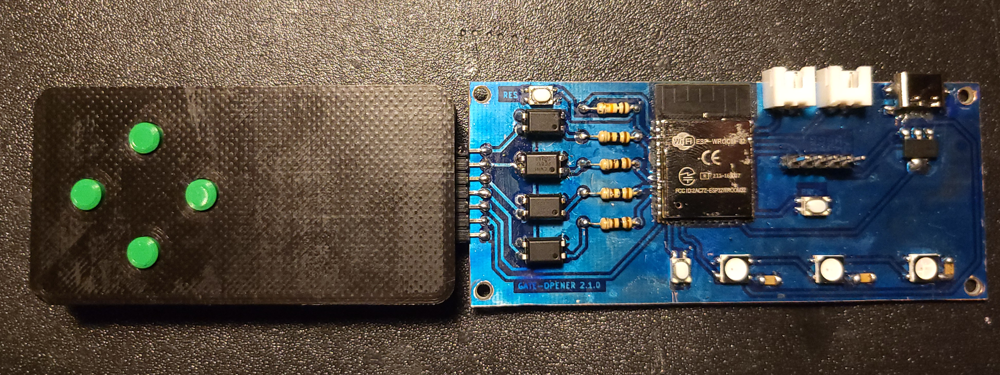
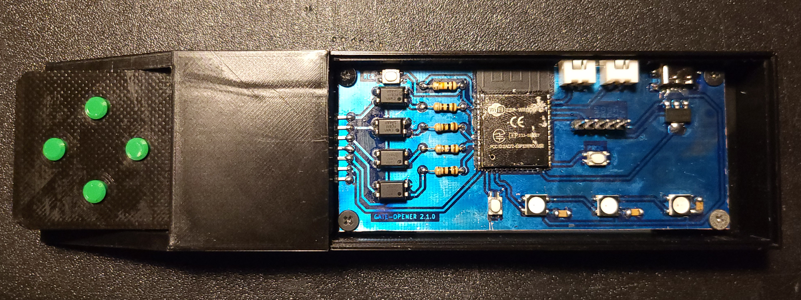
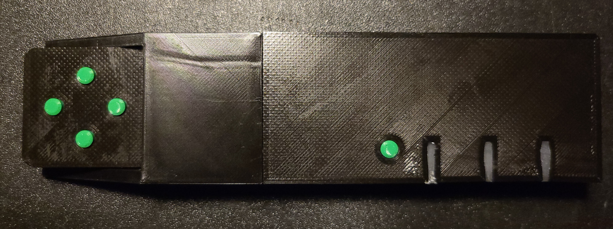

# GATE OPENER V2

## Description

This device can open gate remotly using ESP RainMaker app or Google home.

## Files

- 3D files (case for remtoe and device)
  - [device](./case/device/)
  - [remote](./case/remote/)
- Kicad files (pcb files)
  - [ready for print pdf files](./pcb/)
  - [device](./pcb/main-board/)
  - [remote](./pcb/remote-controller-board/)
- Arduino IDE files (with software)
  - [software](./software/)

## Appearance of the device

## Shopping list

|            Name            | Amount | Url                                                             |
| :------------------------: | :----: | :-------------------------------------------------------------- |
|        ESP-WROOM32         |   1    | [Aliexpress](https://aliexpress.com/item/32808772590.html)      |
|        WS2812B LED         |   3    | [Aliexpress](https://aliexpress.com/item/4001345875756.html)    |
|    Capacitor SMD 100nf     |   3    | [Aliexpress](https://aliexpress.com/item/1005002769519482.html) |
|        USB-C 6 pin         |   1    | [Aliexpress](https://aliexpress.com/item/32966491026.html)      |
| Pin header 7 pin and 5 pin |   1    | [Aliexpress](https://aliexpress.com/item/1005005258694395.html) |
|      Pin socket 7 pin      |   1    | [Aliexpress](https://aliexpress.com/item/4001198421663.html)    |
|      Resistor 10K ohm      |   1    | -                                                               |
|           PC817            |   4    | -                                                               |
|      Resistor 100ohm       |   4    | -                                                               |
| Momentary switch 3x4x2.5mm |   3    | -                                                               |
|        AMS117 3.3V         |   1    | -                                                               |
|       gate remote\*        |   1    | -                                                               |

\* in my case it is **HORMANN HSM4-868**

## Software

### Requirements

- ARDUINO IDE
  - NeoPixel
  - RainMaker

Create config.hpp file in software dir using config-template.hpp and fill gaps.
